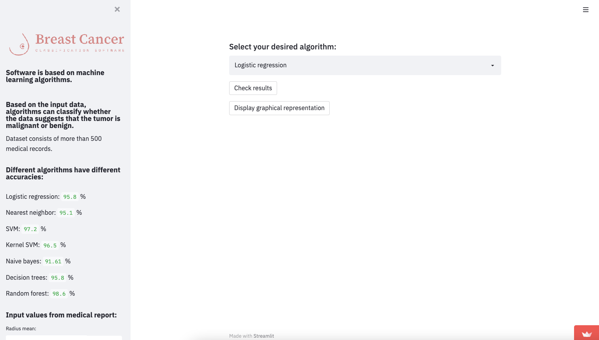
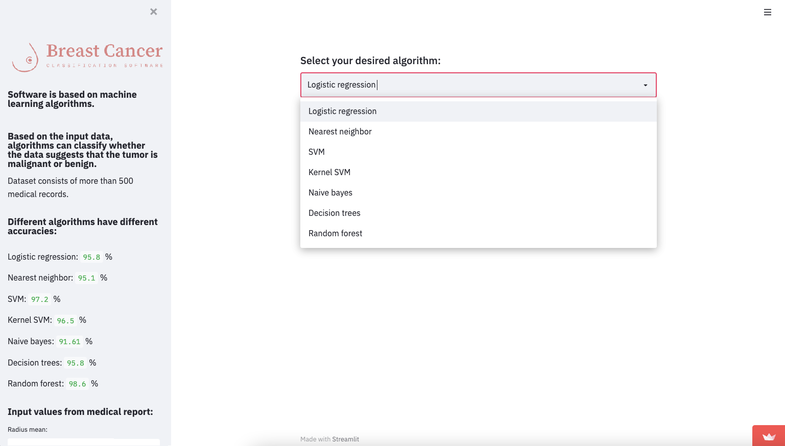
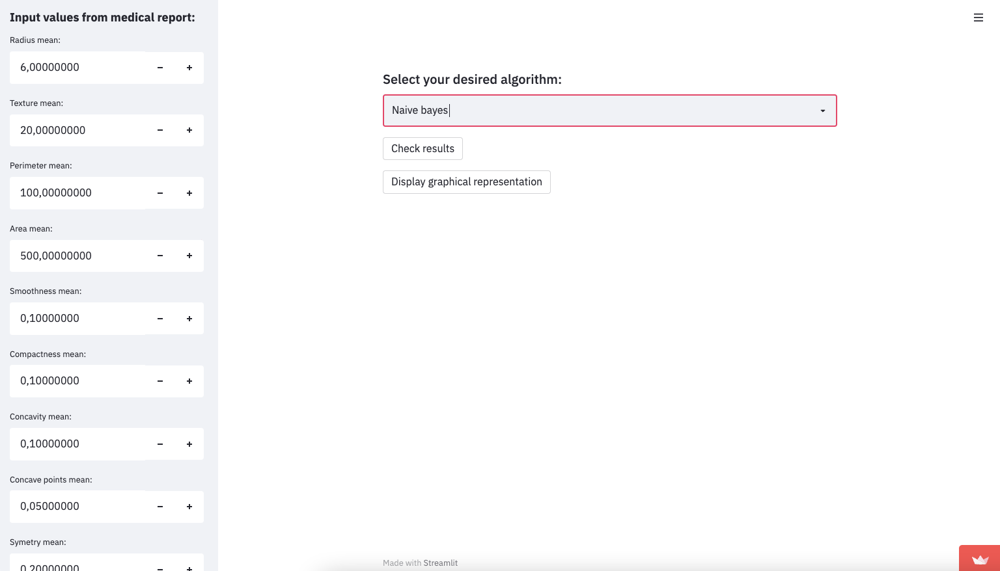
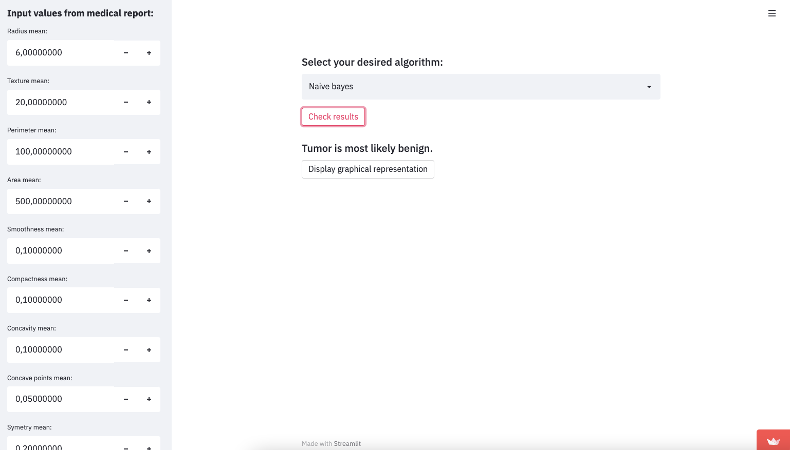
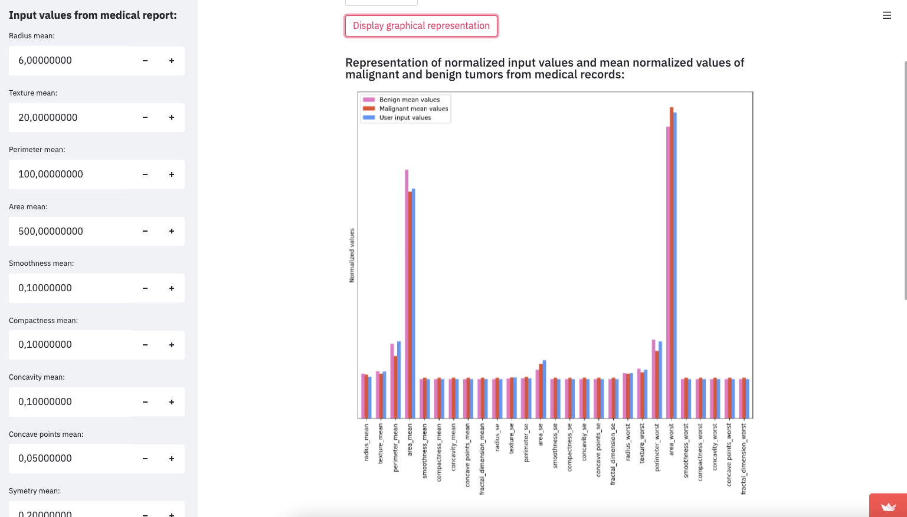
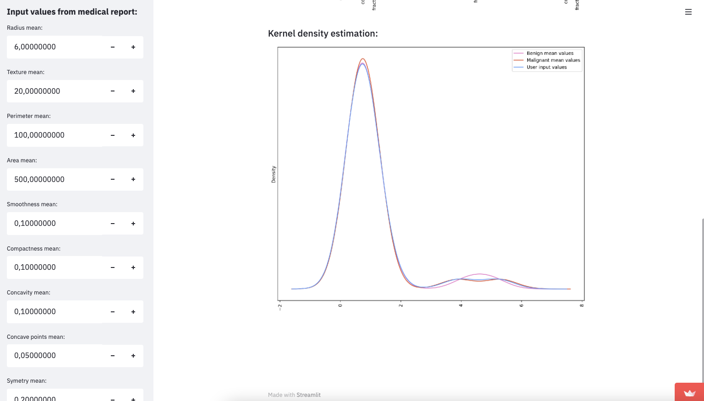

# Breact Cancer Classificiation App

This is a **breast cancer classification app** I made as a first machine learning project. It gave me a better understanding of Pandas and how to import, transform, normalize and use large datasets. 
Other than that, I learned the basics of many machine learning algorithms and how to use libraries incorporating them in Python. 
I am aware that the application could be improved and I am aiming to do this as a side project one day. 

The frontend is done using Streamlit, where I also deployed the application. 

The deployed app can be found here: https://share.streamlit.io/msx-dev/brst-machinelearning/main/Brst.py 

Feel free to roam around the application and if you want to test it, you can use a random value from the dataset, which is found here: https://www.kaggle.com/uciml/breast-cancer-wisconsin-data

# :point_down: Below you can find a simple guide to the app:

This is what you see when you land on the page. 

Now you can simply choose a desired algorithm from the drop-down menu.

Now you can scroll down on the input values section and enter some values (go to the kaggle dataset and choose a patient). 

Now you can click check results and the application will classify whether the tumor is benign or malignant. 

You can check some graphical representation between malignant and benign mean values.

You can also display Kernel Density. 

